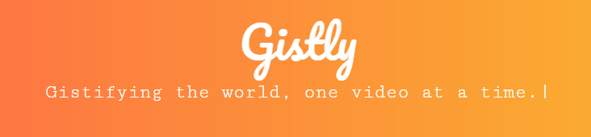
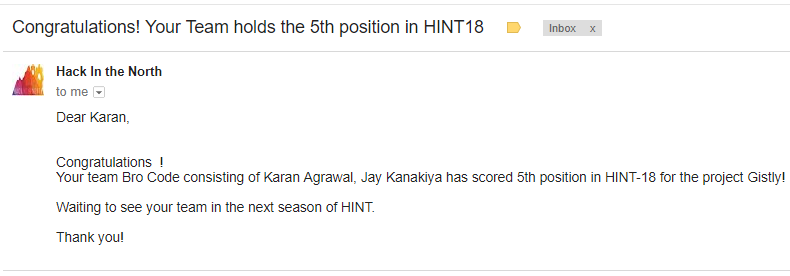

<p align="center">
  <a href="" rel="noopener">
 </a>
</p>

<h3 align="center">Video Summarization Tool</h3>

<div align="center">

[](http://karanagrawal.me/Gistly)
[](https://github.com/karan28598/Gistly/blob/master/LICENSE)
[](https://www.python.org/)

</div>

------------------------------------------

>Too worked up to watch that speech Sundar Pichai gave at Google I/O 2018, or that TED Talk on Procrastination, but still wanna watch it anyway? Wish there was some way of getting through the whole thing without actually watching the whole video? Gistly does it for you! All we ask for is a YouTube URL and we'll do the rest.

------------------------------------------
### Features

- `Video Summarization` to get a condensed version of the video.
<!-- - `Bookmark` an article
- `Summarize` an source article or a url
- Browse across ~ 255 preffered source listed [here](./App/sources.csv)
- Featured Article as per all user reaction ( Also an Add-Ons )
- `Night-Mode` for better readiblity
- Subscribe to your favorite source using `chatbot` and read it on your own comfort from the `web-app` -->

<!-- <div align="center">

<h3 > Gistly as a Web-App  </h3>
<br>
<p align="center">

</p>

<h3><a href="https://www.facebook.com/">  Gistly On Messenger   </a></h3>
<br>


</div> -->

------------------------------------------

### Add-Ons

- [ ] Text Summary
- [ ] Personal Profile
- [ ] Bookmark
- [ ] Translated Summary
- [ ] Customized length of summary video

------------------------------------------

### TO-DO 

- [ ] Change UI
- [ ] Fix for it work for all YouTube links
- [ ] requirements.txt, config.py, package, contributing
- [ ] deploy

------------------------------------------
### File Structure


#### Web-App

- `minify.py` : Source code for the algorithm
- `server.py` : Flask Server
- `templates` : Web Source Code

------------------------------------------
<!-- ### Installation

* Install dependencies
```sh
        $ pip3 install -r requirements.txt
``` -->

------------------------------------------
### Contributing

 We're are open to `enhancements` & `bug-fixes` :smile: 
 <!-- Also do have a look [here](./CONTRIBUTING.md) -->

### Note

- This project was made at [Hack in the North 3.0](https://www.hackinthenorth.com/) in `36 hours with minimal pre-preparation`

------------------------------------------
### Contributors

- [Karan Agrawal](https://github.com/karan28598)
- [Jay Kanakiya](https://github.com/JayKanakiya)

------------------------------------------
### Recognition

- This repository / project was a part of [Hack in the North](https://github.com/HackInTheNorth)

- Gistly held the 5th position in the 7 winners at HINT3.0 out of the 60 teams from all over India

<div align="center">

</div>

